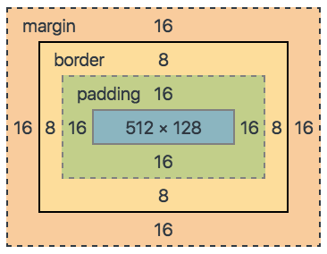
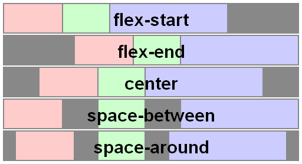
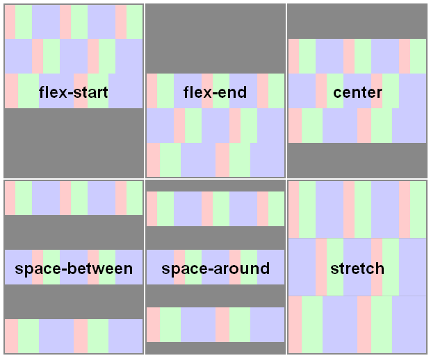

# Exercise 2 - Sizing and the box model
This exercise will focus on the sizing and box model of CSS, which will be important knowledge to have before devling into layouts.

You will learn about:
- Understanding how the box model affects sizing of elements
- Display properties
- Normal flow vs out of flow (float, abolute/fixed positioning)

## The Box model


The box model is a core concept of css which affects all HTML-elements that are displayed, by understanding the box-model you will have a much easier time making layouts for webpages utilizing the different properties. The box model consists of content, padding, border and the margin.

### Content 
The inner layer that contains the contents of the target element. Content can consist of any type of HTML-element
### Padding
Outside of the content layer is the padding. Adding space to the padding will give the visual effect of having white-space around the content.
You can give a box a 10px padding by typing: `padding: 10px`. Padding can also be given specific values such as this `padding-top: 10px` `padding-left: 25px` or the shorthand vertical and hortizontal syntax which is written like this: `padding: 0px 10px`. Or like this `padding: 10px 10px 10px 10px` for top, right, bottom and left padding. It all depends on what you are used to.
### Border
The layer surrounding the padding layer. Many times this will have a small width of maybe only 1 pixel. Unlike the padding and margin layers, this layer can be given color and style. and example of a faint thin grey border could be written like this: `border: 1px solid lightgray`.
### Margin
The outermost layer between the target element and its parent element. Adding space to the margin will give the visual effect of pushing other close elements away with an invisible forcefield. Margins are written in the same style as padding. `margin-top: 10px`, or `margin: 15px 10px 20px 20px` for example.

## Display properties
The display property plays an important role in CSS, it decides how an HTML-element will behave in relation to other elements.
The most important display properties to learn are; none, inline, inline-block, block, flex and grid.
For full details of display properties check out: [Display properties](https://developer.mozilla.org/en-US/docs/Web/CSS/display)

### None
`display: none` takes the whole HTML-element out of the document flow, that means that if you have multiple images for example, and you set them to `display: none` the container will collapse and shrink. 

:exclamation: A similar rule is `visibility: hidden`, it will hide items but not affect their presence in document, making the items still push on eachother while being invisible.

### inline
`display: inline` will make an element behave as an inline element (like <span>). Any height and width properties will have no effect to it. Text and icons are common uses for display: inline.

### inline-block
`display: inline-block` will make an element display as an inline-level block container. The element itself is formatted as an inline element, but you can apply height and width values. Uses for inline-block can be pretty much anything that you want to not take up all available space and control the size of.

### block
`display: block` The block element will take up all horizontal space in the parent container, it will allways start on a new line from previous elements and stretch to the end of what confines it

### Flexbox
Check out this overview for a more detailed explanation of flexbox: [Flexbox concepts](https://developer.mozilla.org/en-US/docs/Web/CSS/CSS_Flexible_Box_Layout/Basic_Concepts_of_Flexbox) Also [This pen by Gabi](https://codepen.io/enxaneta/full/adLPwv) is a good interactive guide to flexbox.
Flexbox is a bit more complicated than the previous displays, putting `display: flex` on a container makes the children elements flex dynamically when the parent container is resized, essentially the elements are stretching and moving either in a row or in a column configuration, imagine a musician playing an accordion. The flex container can have 6 different properties:

#### flex-direction
Flex-direction decides which direction the children elements are flexing. `row` makes the elements flex horizontally `row-reverse` reverses the order of the items in horizontal view, `column` makes the elements spread out vertically, and `column-reverse` will do the same just backwards.

Default flex-direction is set to "row", so if you want a collection of items to spread out vertically you type it like this:
```css
 .main-content {
  display: flex;
  flex-direction: column;
 }
```
#### flex-wrap
The default value for `flex-wrap` is set to no-wrap, this is so that items can behave as described above, like an accordion. Setting the value to wrap will make the HTML-elements "jump" to the next line if the parent container shrinks.

#### flex-flow
`flex-flow` is a shorthand property for setting both `flex-wrap` and `flex-direction`.
```css
 .main-content {
   display: flex;
   flex-flow: row wrap;
 }
 /* is the same as */ 
 .main-content {
   display: flex;
   flex-direction: row;
   flex-wrap: wrap;
 }
```
#### justify-content


Using `justify-content` can control the justification inside the container of flexing items, and also white-space between flexing items and their parent container. The different values are; `center`, `flex-start`(default), `flex-end`, `space-around`, `space-between`.

```css 
 .main-content {
  display: flex;
  justify-content: flex-end; 
  /* this will push all children elements to the right side of the parent container if there is available space */
 }
```

```css 
 .main-content {
  display: flex;
  flex-direction: reverse-row;
  justify-content: center; 
  /* this will make all child elements flex in reverse order and be centered in the parent container */
 }
```

#### align-items


`align-items` property sets the align-self value on all direct children as a group. It sets the default alignment of the flex items along the cross axis of each flex line. If `flex-direction` is row and `align-items` is set to flex-start, the items will attach to the top of the container, if `flex-direction` is set to column however, `flex-start` will be pushed to the right in the container, think of `flex-drirection: column` as where you just flip the whole container forward 90degrees.


#### align-content


`align-content` aligns the flex-lines within the flex container when there is extra space in the cross-axis. This rule is only applied when you have a flex container with multiple lines of flexing items.

## Flow
Explained in simple terms; elements can be said to be in normal flow when they appear on the page in the order that they are in the source. Things get interesting however when we take items out of normal flow. Using css rules such as `position: absolute` and `position: fixed` will take an element out of the flow, and the remaining elements will behave as if the out-of-flow element is not present. 

These two css properties come with the values `top`, `left`, `right` and `bottom`, indicating to where the out-of-flow element will attach to. `position: fixed` is placed at a fixed point in relation to the browser window, `position: absolute` will be placed in relation to the closes element with `position: relative`, if none is found then it will be in relation to the browser window. When this is the case there is a slight difference between the two, `position: fixed` will be hovering in the same place in the browser window while you scroll, while `position: absolute` will still disappear if you scroll past the relative parent.


## :pencil2: Box-model Tasks
Remember to ask if you are stuck, also [MDN](https://developer.mozilla.org/en-US/docs/Web/CSS) is a good resource.
In this exercise use the example code in this code pen: [Box-model Tasks](https://codepen.io/taranger/pen/moLWMB)
Solution to the box-model tasks can be found here: [Box-model Tasks solution](https://codepen.io/taranger/pen/XGqVXL)

#### Task 1
Try giving the .item class a padding of 20px and see what happens. The span elements are displayed as inline by default, so when setting padding to 20px, the elements will flow outside of the container.

#### Task 2
Try and give the .item class a display property with the value inline-block and see what happens. The span elements will now take up more space because they are formatted as block elements while still being inline.

#### Task 3
To make the boxes look more fancy, lets make the width and height 100px, also add some space between them by adding a margin of 20px

#### Task 4
Lets add a border to the boxes, border properties are written in this format: `border: 1px solid black`. Try to make a 1px red solid border on the #container and a 2px white dashed border on the .item class.

## :pencil2: Flexbox Tasks
Remember to ask if you are stuck, also [MDN](https://developer.mozilla.org/en-US/docs/Web/CSS) is a good resource.
In this exercise use the example code in this code pen: [Flexbox Tasks](https://codepen.io/taranger/pen/OqZzWz)
Solution to the Flexbox Tasks can be found here: [Flexbox Tasks solution](https://codepen.io/taranger/pen/xBjeLG)

Open the flexbox tasks code pen and start by dragging the window divider in the middle of the screen to try and squeeze the boxes on the right. Or you can drag the whole browser window and see what happens. Since the container does not have the flex dispaly property, and the children elements have the inline-block display property, they will wrap to the next line when whe available space is gone.

#### Task 1
We want to make this container and its elements flex, so lets start by giving the html element with the class ".flex-container" a display property of "flex". squeeze the browser window as you just did but observe how the children behave 

#### Task 2
Flex-direction is now set to row, as it is default. Change the flex-direction on the flex-container to column but in a reverse order.

#### Task 3
Make it so that the flexing items are centered inside the flex container using the align-items property.

#### Task 4
Use justify-content property and find a value that makes it so that all the flex children have space between eachother.

## :pencil2: Flow Tasks
Remember to ask if you are stuck, also [MDN](https://developer.mozilla.org/en-US/docs/Web/CSS) is a good resource.
In this exercise use the example code in this code pen: [Flow Tasks](https://codepen.io/taranger/pen/QorPXP)
Solution to the Flow Tasks can be found here: [Flow Tasks solution](https://codepen.io/taranger/pen/oVdRXG)

In this task we have a chatbox that is placed together with the rest of the content on the site, we want it to be placed outside of the content and be available while browsing the site.

#### Task 1
Add a absolute position property to the chatbox and observe what happens. The content around it will collapse and the box is not taken out of the document flow.

#### Task 2 
position the chatbox 10 pixels from the top and 5 pixels from the left. The box will now look for the nearest element with relative positioning and lock to it. Since the content container does not have any position: relative to it. The chatbox will position itself based on the browser window instead.

#### Task 3
Notice that when we scroll on the site, the chatbox does not follow us. We want it to follow us while we scroll. Make it into a fixed position instead.

#### Task 4
Now the box is fixed onto the browser window, change the position to the bottom right side instead.
